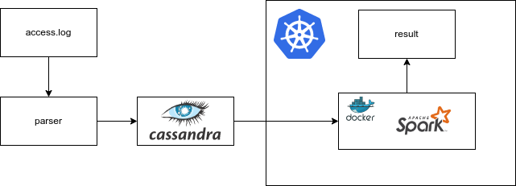
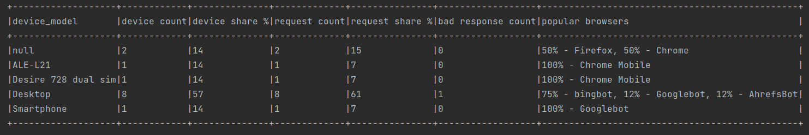

# Анализ логов Apache

<div align="center">


</div>


## Описание проекта с требованиями

Общая задача: создать скрипт для формирования витрины на основе логов web-сайта.

<details>
  <summary>Подробное описание задачи</summary>

Разработать скрипт формирования витрины следующего содержания:
1. Суррогатный ключ устройства
1. Название устройства
1. Количество пользователей
1. Доля пользователей данного устройства от общего числа пользователей.
1. Количество совершенных действий для данного устройства
1. Доля совершенных действий с данного устройства, относительно других устройств
1. Список из 5 самых популярных браузеров, используемых на данном устройстве различными пользователями, с указанием доли использования для данного браузера относительно остальных браузеров. 
1. Количество ответов сервера отличных от 200 на данном устройстве
1. Для каждого из ответов сервера, отличных от 200, сформировать поле, в котором будет содержаться количество ответов данного типа

Источники:

https://disk.yandex.ru/d/BsdiH3DMTHpPrw

</details>

## План реализации

### Используемые технологии
Технологический стек – Apache Spark 3.3.1, Cassandra 4.0.7, Python 3.10, Minikube v1.28.0.

В качестве файловой системы используется обычная файловая система хостовой машины.

### Схема



Программа может работать в двух режимах

1. Инициализирующий

    Если в **parser.py** установить значение переменной **data_loading_mode=DataLoadingMode.Initializing**, то **access.log** файл будет сконвертирован в csv файл, для последующей загрузки средствами Cassandra (методом COPY).

2. Инкрементальный

    Если в **parser.py** установить значение переменной **data_loading_mode=DataLoadingMode.Incremental**, то **access.log** файл будет загружаться в Cassandra прямо из парсера.


После загрузки в Cassandra, Spark уже может брать данные и строить витрины, сохраняя результат.


### Настройка и запуск

#### Cassandra

Полезные ссылки:
- https://cassandra.apache.org/doc/latest/cassandra/getting_started/installing.html
- https://docs.datastax.com/en/developer/python-driver/3.25/getting_started/
- https://github.com/datastax/spark-cassandra-connector
- https://stackoverflow.com/questions/69027126/how-do-i-connect-to-cassandra-with-dbeaver-community-edition

```bash
bin/cassandra
bin/nodetool status
bin/cqlsh
```

Создание таблицы:

```sql
CREATE KEYSPACE my_keyspace WITH replication = {'class': 'SimpleStrategy', 'replication_factor': 1};

USE my_keyspace;

CREATE TABLE apache_logs (
    remote_host text,
    remote_logname text,
    remote_user text,
    request_time timestamp,
    request_line text,
    final_status int,
    bytes_sent int,
    user_agent text,
    device_family text,
    device_brand text,
    device_model text,
    browser_family text,
    browser_version text,
    is_mobile boolean,
    is_tablet boolean,
    is_pc boolean,
    is_bot boolean,
    PRIMARY KEY (remote_host, request_time)
);
```

Загрузка CSV в случае инициализирующей загрузки:

```sql
COPY apache_logs(remote_host, remote_logname, remote_user, request_time, request_line, final_status, bytes_sent, user_agent, device_family, device_brand, device_model, browser_family, browser_version, is_mobile, is_tablet, is_pc, is_bot) FROM 'apache logs path' WITH DELIMITER=',' AND HEADER=TRUE;
```

#### Kubernetes

minikube version: v1.28.0

<details>
  <summary>Пример</summary>

```bash
minikube start --driver=docker --mount --mount-string "/dir/to/share:/tmp/apache_logs_analysis"

# Билдим образ:
docker build -f ./docker/Dockerfile -t izair/apache_logs_analysis:1.0.4 .
docker push izair/apache_logs_analysis:1.0.4

# Заранее пулим:
minikube ssh docker pull izair/apache_logs_analysis:1.0.4

# Потом смонтированную папку смонтируем на POD:
export VOLUME_TYPE=hostPath
export VOLUME_NAME=demo-host-mount
export MOUNT_PATH=/tmp/apache_logs_analysis

# Открываем порт 8001:
kubectl proxy

spark-submit \
  --master=k8s://http://127.0.0.1:8001 \
  --deploy-mode cluster \
  --name apache_logs_analysis \
  --class org.example.App \
  --conf "spark.kubernetes.container.image=izair/apache_logs_analysis:1.0.4" \
  --conf spark.kubernetes.driver.volumes.$VOLUME_TYPE.$VOLUME_NAME.mount.path=$MOUNT_PATH \
  --conf spark.kubernetes.driver.volumes.$VOLUME_TYPE.$VOLUME_NAME.options.path=$MOUNT_PATH \
  --conf spark.kubernetes.executor.volumes.$VOLUME_TYPE.$VOLUME_NAME.mount.path=$MOUNT_PATH \
  --conf spark.kubernetes.executor.volumes.$VOLUME_TYPE.$VOLUME_NAME.options.path=$MOUNT_PATH \
  --conf spark.executor.instances=1 \
  --conf spark.driver.memory=512m \
  --conf spark.executor.memory=512m \
  --conf spark.driver.cores=1 \
  --conf spark.executor.cores=1 \
  --conf spark.kubernetes.namespace=default \
  local:///opt/apache_logs_analysis-1.0-jar-with-dependencies.jar

# Смотрим логи:
minikube dashboard
```
</details>

## Результаты разработки
В результате был создан проект со следующей структурой:
```bash
.
├── cassandra                  # cassandra commands
├── data                       # data files
├── docs                       # documentation
├── images                     # screenshots
├── python                     # python source files
├── spark                      # spark source files
└── README.md
```

<details>
  <summary>Пример витрины данных</summary>

  

</details>
